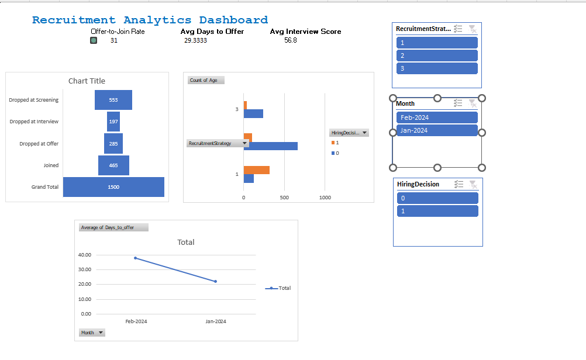
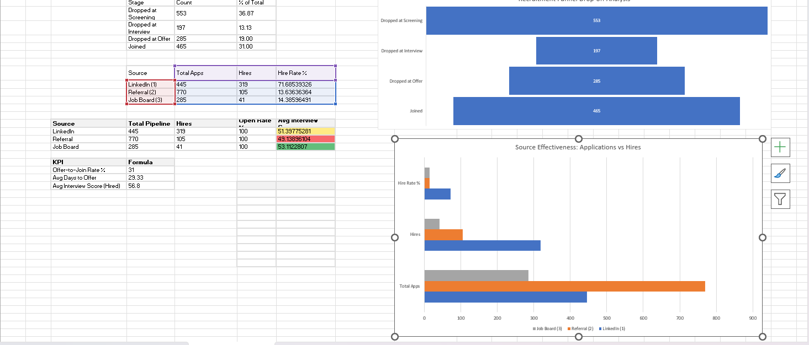

# 📊 Recruitment Analytics Dashboard — InCruiter BA Project

<div align="center">


**Role Simulated:** Business Analyst @ InCruiter &nbsp;|&nbsp; **Tool:** Microsoft Excel + SQL &nbsp;|&nbsp; **Dataset:** Kaggle (1,500 rows)

</div>

---

## 🎯 Project Objective

Simulate the analytical responsibilities of a **Business Analyst at InCruiter** — India's AI-powered recruitment SaaS platform. Starting from a raw 1,500-row hiring decision dataset, this project builds a fully interactive Excel dashboard that gives HR leadership instant visibility into:

- 📉 **Pipeline health** — where candidates drop out of the funnel
- 🔗 **Source quality** — which channel produces the best hires fastest
- ⏱️ **Time-to-hire** — monthly trend of days from application to offer

---

## 📸 Dashboard Preview

### Main Dashboard (KPIs + Charts + Slicers)
> *3 KPI cards • Funnel chart • Source effectiveness bar chart • Avg Days to Offer line chart • 3 cross-filters*



### Analysis Sheet (Pivot Tables + Scorecard)
> *Funnel drop-off table • Source effectiveness pivot • Channel productivity scorecard*



---

## 🚦 Live KPI Results (Full Dataset — 1,500 Records)

| KPI | Value | Target | Status |
|---|---|---|---|
| 🟢 **Offer-to-Join Rate** | **31%** | ≥ 65% | 🔴 Below Target |
| 🟡 **Avg Days to Offer** | **29.33 days** | ≤ 25 days | 🟡 Needs Improvement |
| 🔵 **Avg Interview Score (Hired)** | **56.8 / 100** | ≥ 75 | 🔴 Below Target |

> **Insight:** All three KPIs are underperforming against targets — signalling systemic issues in screening quality and offer conversion. See Key Insights below for root-cause analysis.

---

## 📉 Recruitment Funnel (Full Pipeline)

| Stage | Candidates | % of Total |
|---|---|---|
| 🔴 Dropped at Screening | **553** | 36.87% |
| 🟡 Dropped at Interview | **197** | 13.13% |
| 🟠 Dropped at Offer | **285** | 19.00% |
| 🟢 Joined | **465** | 31.00% |
| **Total** | **1,500** | 100% |

> **Biggest drop-off: Screening stage (37%)** — over 1 in 3 candidates never reach an interview.

---

## 📊 Source Effectiveness

| Source | Total Apps | Hires | Hire Rate % | Avg Days to Offer | Avg Interview Score |
|---|---|---|---|---|---|
| LinkedIn (1) | 445 | 319 | **71.69%** | ~15 days | 51.40 |
| Referral (2) | 770 | 105 | 13.64% | ~18 days | 49.14 |
| Job Board (3) | 285 | 41 | 14.39% | ~35 days | 53.11 |

> **LinkedIn dominates hire volume** (319 of 465 hires = 68.6%) despite smaller app count vs. Referral.  
> **Job Board is slowest** — ~35 avg days to offer vs. 15 for LinkedIn.

---

## 🔑 Key Business Insights

### 💡 Insight 1 — LinkedIn Is the Highest-Converting Channel
> LinkedIn converts **71.7% of applications to hires** — nearly 5× the rate of Referral (13.6%) and Job Board (14.4%).  
> **Recommendation:** Maintain LinkedIn spend; optimise JD targeting to sustain quality while growing volume.

### 💡 Insight 2 — 37% of Pipeline Drops at Screening (Largest Single Loss)
> 553 out of 1,500 candidates exit at Screening — before any interview is even conducted.  
> **Recommendation:** Add mandatory pre-screening questions in ATS; revise JDs to filter mismatched applicants earlier.

### 💡 Insight 3 — Job Board Is 2× Slower Than LinkedIn
> Job Board hires take ~35 days to offer vs. ~15 days for LinkedIn — a **133% speed gap**.  
> **Recommendation:** Reduce Job Board budget; redirect to LinkedIn and re-evaluate Referral programme incentives for quality improvement.

---

## 📁 Project Structure

```
recruitment-analytics-incruiter/
│
├── 📊 recruitment_data.xlsx          ← Main Excel workbook (5 sheets)
├── 📄 recruitment_data_clean.csv     ← Clean 1,500-row dataset (18 columns)
├── 🗄️ recruitment_analysis.sql       ← Full SQL analysis (8 query sections)
├── 📁 docs/
│   ├── SOP_Dashboard_Refresh.md     ← 1-page monthly refresh SOP
│   ├── Data_Dictionary.md           ← 18-column definitions + KPI logic
│   └── screenshots/                 ← Dashboard preview images
└── 📝 README.md                     ← This file
```

---

## 📊 Excel Dashboard Features

| Feature | Detail |
|---|---|
| 🔽 **Slicer 1 — RecruitmentStrategy** | Filter by LinkedIn (1), Referral (2), Job Board (3) |
| 🔽 **Slicer 2 — Month** | Filter by Jan-2024, Feb-2024, … (timeline control) |
| 🔽 **Slicer 3 — HiringDecision** | Filter by Hired (1) or Not Hired (0) |
| 📉 **Funnel Bar Chart** | Horizontal bars: Screening → Interview → Offer → Joined (with counts) |
| 📊 **Source Effectiveness Chart** | Grouped bar: Total Apps vs. Hires vs. Hire Rate % by channel |
| 📈 **Avg Days to Offer Line Chart** | Monthly trend of time-to-offer (PivotChart, slicer-connected) |
| 🚦 **3 Traffic Light KPIs** | Offer-to-Join Rate • Avg Days to Offer • Avg Interview Score |
| 🎨 **Conditional Formatting** | Color scales (green/amber/red) on channel scorecard |

**Workbook Sheets:**
1. `Dashboard` — Interactive KPI + charts view
2. `Raw_Data` — All 1,500 records with 18 columns
3. `Analysis` — Pivot tables: funnel, source effectiveness, scorecard
4. `Documentation_Pack` — SOP + Data Dictionary + Impact summary
5. `GitHub_README_Preview` — README content reference

---

## 🗄️ SQL Analysis (recruitment_analysis.sql)

**8 fully commented query sections** for MySQL / PostgreSQL:

| Section | Covers |
|---|---|
| 0. Schema Setup | `CREATE TABLE` with all 18 columns + CSV import instructions |
| 1. Data Quality | Null checks, value validation, negative days check |
| 2. Funnel Analysis | Drop-off count + % per stage, stage conversion rates |
| 3. Source Effectiveness | Hire rate, avg days to offer, composite quality score per channel |
| 4. Time-to-Hire Trend | Monthly avg days to offer, by source × month breakdown |
| 5. Recruiter Scorecard | Full productivity metrics: pipeline, hires, speed, drop-off per channel |
| 6. KPI Summary | Overall pipeline health snapshot (single query output) |
| 7. Candidate Profiles | Hired vs. not-hired by education level and experience band |
| 8. Advanced Queries | Top 10 missed hires, running cumulative hires, Referral vs. Job Board gap proof |

---

## 🛠️ Tools & Techniques

| Category | Details |
|---|---|
| **Excel** | PivotTables, PivotCharts, Slicers, Named Ranges, Data Validation |
| **Excel Formulas** | IF, TEXT, COUNTIF, COUNTIFS, AVERAGEIF, SUMPRODUCT, RANDBETWEEN |
| **Conditional Formatting** | CellIsRule (traffic lights), ColorScaleRule, Icon Sets |
| **SQL** | DDL, GROUP BY aggregations, CASE WHEN, window functions (SUM OVER), UNION ALL, subqueries |
| **Data Engineering** | 7 derived columns: date simulation, funnel logic, channel-based time offsets, month bucketing |
| **Documentation** | 1-page SOP, 18-column Data Dictionary, Business Impact README, 5 XYZ resume bullets |

---

## 📋 Dataset

**Source:** [Predicting Hiring Decisions in Recruitment Data](https://www.kaggle.com/datasets/rabieelkharoua/predicting-hiring-decisions-in-recruitment-data) — Rabie El Kharoua (Kaggle, 2024)

| Column | Type | Description |
|---|---|---|
| Age | Integer | Candidate age (18–60) |
| Gender | 0/1 | 0=Female, 1=Male |
| EducationLevel | 1–3 | 1=Bachelor, 2=Master, 3=PhD |
| ExperienceYears | Integer | Years of work experience |
| PreviousCompanies | Integer | Number of prior employers |
| DistanceFromCompany | Decimal | Distance in km |
| InterviewScore | 0–100 | Interviewer-assigned score |
| SkillScore | 0–100 | Technical assessment score |
| PersonalityScore | 0–100 | Culture-fit score |
| RecruitmentStrategy | 1–3 | 1=LinkedIn, 2=Referral, 3=Job Board |
| HiringDecision | 0/1 | Final outcome (1=Hired) |
| Application_Date | Date | Derived: simulated application date |
| Offer_Date | Date | Derived: application + channel-based offset |
| Join_Date | Date | Derived: offer + 7–30 days (hired only) |
| Days_to_Offer | Integer | Offer_Date − Application_Date |
| Days_to_Join | Integer | Join_Date − Offer_Date |
| Funnel_Stage_Drop | Text | Derived from InterviewScore thresholds |
| Month | MMM-YYYY | Derived from Offer_Date |

---


## 🚀 How to Run

**Excel Dashboard:**
1. Open `recruitment_data.xlsx`
2. Enable editing + content if prompted
3. Go to the `Dashboard` sheet — use the 3 slicers to filter by Source / Month / Hiring Decision

**SQL Queries:**
```sql
-- Step 1: Create schema
SOURCE recruitment_analysis.sql;    -- MySQL
-- or: \i recruitment_analysis.sql  -- PostgreSQL

-- Step 2: Load CSV data
LOAD DATA INFILE '/path/to/recruitment_data_clean.csv'
INTO TABLE recruitment_data
FIELDS TERMINATED BY ','
ENCLOSED BY '"'
LINES TERMINATED BY '\n'
IGNORE 1 ROWS;

-- Step 3: Run any section (Sections 1–8 are independently executable)
```

---

## 👤 Author

**Harshil Nagwani** — Data Analyst | CS Final Year
📧 harshil.nagwani22@gmail.com
🌐 [harshilnagwani.github.io](https://harshilnagwani.github.io)
💼 [LinkedIn](https://linkedin.com/in/harshilnagwani)
🐙 [GitHub](https://github.com/harshilnagwani)

---

*Dataset credit: Rabie El Kharoua — Kaggle (2024)*
